# Cross Da Road - Documentation

## Table of Contents

- [Cross Da Road - Documentation](#cross-da-road---documentation)
  - [Table of Contents](#table-of-contents)
  - [1. Introduction](#1-introduction)
    - [1.1 Project Overview](#11-project-overview)
    - [1.2 Objective](#12-objective)
    - [1.3 Target Audience](#13-target-audience)
    - [1.4 Inspiration](#14-inspiration)
    - [1.5 Development Team](#15-development-team)
    - [1.6 Development Tools](#16-development-tools)
    - [1.7 Development Timeline](#17-development-timeline)
    - [1.8 Acknowledgements](#18-acknowledgements)
  - [2. Installation and Setup Guide](#2-installation-and-setup-guide)
    - [2.1 System Requirements](#21-system-requirements)
    - [2.2 Installation and Setup Guide](#22-installation-and-setup-guide)
  - [3. System Architecture](#3-system-architecture)
    - [3.1 Overview - Directory Structure](#31-overview---directory-structure)
    - [3.2 Class Diagram (UML)](#32-class-diagram-uml)
    - [3.3 Game Engine](#33-game-engine)
    - [3.4 Game Loop](#34-game-loop)
    - [3.5 Input Handling](#35-input-handling)
    - [3.6 Rendering Pipeline](#36-rendering-pipeline)
    - [3.7 Physics Engine Integration](#37-physics-engine-integration)
    - [3.8 Audio System](#38-audio-system)
    - [3.9 Game State Management](#39-game-state-management)
    - [3.10 Concurrency and Multithreading](#310-concurrency-and-multithreading)
    - [3.11 Data Storage and Persistence](#311-data-storage-and-persistence)
  - [4. User Guide](#4-user-guide)
    - [4.1 Getting Started](#41-getting-started)
    - [4.2 Controls](#42-controls)
    - [4.3 Objectives](#43-objectives)
    - [4.4 Game Interface](#44-game-interface)
    - [4.5 Tips and Strategies](#45-tips-and-strategies)
    - [4.7 Saving and Loading](#47-saving-and-loading)
    - [4.8 Frequently Asked Questions (FAQ)](#48-frequently-asked-questions-faq)
  - [5. Developer Guide](#5-developer-guide)
    - [5.1 Introduction for Developers](#51-introduction-for-developers)
    - [5.2 Development Environment Setup](#52-development-environment-setup)
    - [5.3 Code Structure and Organization](#53-code-structure-and-organization)
    - [5.4 Coding Conventions and Standards](#54-coding-conventions-and-standards)
    - [5.5 Game Architecture Overview](#55-game-architecture-overview)
    - [5.6 Documentation and Comments Standards](#56-documentation-and-comments-standards)
  - [6. Libraries and Dependencies](#6-libraries-and-dependencies)
  - [7. Future Development](#7-future-development)
    - [7.1 Upcoming Features](#71-upcoming-features)
    - [7.2 Community Feedback and Involvement](#72-community-feedback-and-involvement)
    - [7.3 Platform Support](#73-platform-support)
  - [8. References](#8-references)
  - [9. License](#9-license)

## 1. Introduction

### 1.1 Project Overview

Welcome to the "Cross the Road" console game!
In this text-based adventure, you'll control a character on a daring journey to cross a busy road while avoiding a series of challenging obstacles.

**Features:**

- **Traffic Chaos**: The road is teeming with speedy cars. Navigate through the traffic like a pro.

- **River Crossings**: Your journey also involves crossing rivers. Jump onto floating logs to cross water bodies.
- **Game Engine**: Our internally developed game engine ensures smooth game-play, realistic physics, and engaging graphics, all within the console.
- **Dynamic Obstacles**: The game features various obstacles, including fast cars, slow-moving trucks, and swift rivers with limited time to cross.
- **High Score**: Challenge yourself to beat your high score with each game session.
- **Time Pressure**: In later levels, the game intensifies with time constraints.

### 1.2 Objective

Your mission is simple but challenging:

- Guide your character from the bottom of the screen to the top safely, all while dodging oncoming traffic and other obstacles.
- The more successful crossings you achieve, the higher your score will be. Can you set a new record?

### 1.3 Target Audience

This game is suitable for all ages, especially those who enjoy a challenge.

### 1.4 Inspiration

This game is inspired by the classic arcade game "Frogger" (1981).

### 1.5 Development Team

**School:** VNUHCM - University of Science

**Faculty:** Faculty of Information Technology

**Course:** CSC10004 - Introduction to Object-Oriented Programming

**Class:** 22CLC06

**Group:** 04

**Members:**

- 22127022 - Vo Hoang Anh
- 22127154 - Nguyen Gia Huy
- 22127192 - Tran Gia Khiem
- 22127210 - Pham Anh Khoi

### 1.6 Development Tools

- **IDE:** Visual Studio 2022
- **Language:** C++
- **Compiler:** g++ (version 7.3.0 or above) or compatible C++17 compiler
- **Libraries:** Windows.h, openGL
- **Version Control:** Git
- **Documentation:** Markdown
- **Project Management:** Trello
- **Communication:** Discord
- **Code Review:** GitHub
- **Testing:** Visual Studio 2022
- **Graphics:** Aesprite (for pixel art)
- **Music:** .wav files

### 1.7 Development Timeline

### 1.8 Acknowledgements

- **Mr. Truong Toan Thinh** - Lecturer, Faculty of Information Technology, VNUHCM - University of Science
- **Mr. Nguyen Hai Dang** - Lab Assistant, Faculty of Information Technology, VNUHCM - University of Science
- **Mr. Do Trong Le** - Lab Assistant, Faculty of Information Technology, VNUHCM - University of Science

## 2. Installation and Setup Guide

### 2.1 System Requirements

- **Operating System:** Windows 10 or above
- **IDE:** Visual Studio 2022

### 2.2 Installation and Setup Guide

- **Step 1:** Clone [this](https://github.com/SPyofgame200/CrossDaRoad-Beta.git) repository to your local machine.
- **Step 2:** Open the project in Visual Studio 2022.
- **Step 3:** Build the project.
- **Step 4:** Run the executable file `CrossDaRoad.exe` in the `bin` folder or run the project in Visual Studio 2022 by pressing `F5`.
- **Step 5:** Enjoy the game!
- **Step 6:** (Optional) If you want to turn on/off the sound, click `Settings` in the main menu and toggle the `Music` option.

## 3. System Architecture

### 3.1 Overview - Directory Structure

- **Class Diagram (UML):** The class diagram shows the relationships between the classes in the game.
- **Game Engine:** Our internally developed game engine ensures smooth game-play, realistic physics, and engaging graphics, all within the console.
- **Game Loop:** The game loop is the main loop that controls the flow of the game.
- **Input Handling:** The game engine handles user input and passes it to the game loop.
- **Rendering Pipeline:** The game engine renders the game objects to the console.
- **Physics Engine Integration:** The game engine integrates the physics engine to handle collisions between game objects.
- **Audio System:** The game engine plays sound effects and background music.
- **Game State Management:** The game engine manages the game states.
- **Concurrency and Multithreading:** The game engine uses multithreading to handle user input and rendering.
- **Data Storage and Persistence:** The game engine stores and loads game data.
- [**Directory Structure**](./standard/directoryStructure.md): The directory structure of the project.

### 3.2 Class Diagram (UML)

### 3.3 Game Engine

The game engine is the core of the game. It handles the game loop, input handling, rendering pipeline, physics engine integration, audio system, game state management, concurrency and multithreading, and data storage and persistence.

### 3.4 Game Loop

Fundamental structure of your game loop: The game loop is the main loop that controls the flow of the game. It consists of the following steps:

- **Step 1:** Handle user input.
- **Step 2:** Update the game state.
- **Step 3:** Render the game objects.
- **Step 4:** Repeat from step 1.

The game progresses from one frame to the next by updating the game state and rendering the game objects. The game state is updated by handling user input and updating the game objects. The game objects are rendered by the rendering pipeline. The rendering pipeline renders the game objects to the console. The game objects are rendered in the following order: background, game objects, user interface.

### 3.5 Input Handling

The game engine handles user input and passes it to the game loop. The game engine handles the following user input through the keyboard: (Note: The game engine does not handle mouse input.)

- **A** - Move left
- **D** - Move right
- **W** - Move up
- **S** - Move down
- **ESC** - Pause the game
- **ENTER** - Select an option
- **ARROW KEYS** - Navigate the menu options
- **Letter keys** - Enter player name in the `New Game` menu

### 3.6 Rendering Pipeline

Process of rendering game objects to the console: The rendering pipeline renders the game objects to the console. The game objects are rendered in the following order: background, game objects, user interface.

The game engine supports the following types of graphics:

- **Text:** Renders text to the console.
- **Sprites:** Renders sprites to the console. (.png files)
- **Animations:** Renders animations to the console. (multiple .png files)
- **Sound Effects:** Plays sound effects. (.wav files)
- **Background Music:** Plays background music. (.wav files)
- **User Interface:** Renders the user interface to the console.
- **Game Objects:** Renders the game objects to the console.

### 3.7 Physics Engine Integration

How the physics engine is integrated into your game: The game engine integrates the physics engine to handle collisions between game objects. The game engine uses the following types of physics:

- **Collision Detection:** Detects collisions between game objects.
- **Collision Resolution:** Resolves collisions between game objects.
- **Collision Response:** Responds to collisions between game objects.
- **Collision Filtering:** Filters collisions between game objects.
- **Collision Callbacks:** Calls back when collisions occur between game objects.
- **Collision Layers:** Layers collisions between game objects.
- **Collision Groups:** Groups collisions between game objects.

### 3.8 Audio System

The game engine plays sound effects and background music. The game engine uses the following types of audio:

- **Sound Effects:** Plays sound effects. (.wav files)
- **Background Music:** Plays background music. (.wav files)
- **Audio Callbacks:** Calls back when audio events occur.
- **Audio Filters:** Filters audio events.
- **Audio Groups:** Groups audio events.
- **Audio Layers:** Layers audio events.
- **Audio Mixing:** Mixes audio events.
- **Audio Pitch:** Changes the pitch of audio events.

The game engine stores and loads game data. The game engine uses the following types of data storage and persistence:

- **Data Storage:** Stores game data.
- **Data Loading:** Loads game data.

### 3.9 Game State Management

The game engine manages the game states. The game engine uses the following types of game states:

- **Main Menu:** The main menu is the first screen that the player sees when they start the game. It contains the following options: `New Game`, `Load Game`, `Settings`, `About us`, and `Exit`.
- **New Game:** The new game menu is the screen that the player sees when they select the `New Game` option in the main menu. It contains an input field for the player to enter their name. Then the player can start a new game. The player can also go back to the main menu.
- **Load Game:** The load game menu is the screen that the player sees when they select the `Load Game` option in the main menu. It contains a list of saved games. The player can select a saved game to load. The player can also go back to the main menu.
- **Settings:** The settings menu is the screen that the player sees when they select the `Settings` option in the main menu. It contains the following options: `Music`. The player can toggle the `Music` options. The player can also go back to the main menu.
- **About us:** The about us menu is the screen that the player sees when they select the `About us` option in the main menu. It contains information about the game and the development team. The player can also go back to the main menu.
- **Exit:** The exit menu is the screen that the player sees when they select the `Exit` option in the main menu. It contains the following options: `Yes` and `No`. The player can select the `Yes` option to exit the game. The player can select the `No` option to go back to the main menu.

### 3.10 Concurrency and Multithreading

The game engine uses multithreading to handle user input and rendering. The game engine uses the following types of concurrency and multithreading:

- **Multithreading:** Uses multiple threads to handle user input and rendering.

### 3.11 Data Storage and Persistence

The game engine stores and loads game data. The game engine uses the following types of data storage and persistence:

- **Data Storage:** Stores game data.
- **Data Loading:** Loads game data.

#### Data Storage Structure

The game engine stores game data in the following structure:

- **data/**
  - **assets/** (contains game assets)
    - ***.png**
  - **icons/** (contains game icons)
    - ***.png**
  - **maps/** (contains game maps describing the game world)
    - ***.txt**
  - **music/** (contains game music)
    - ***.wav**
  - **save/** (contains saved games)
    - ***.txt**
  - ***report/** (contains game logs)
    - ***.txt**

## 4. User Guide

### 4.1 Getting Started

Welcome to the "Cross the Road" console game! In this text-based adventure, you'll control a character on a daring journey to cross a busy road while avoiding a series of challenging obstacles.

The main menu is the first screen that the player sees when they start the game. It contains the following options: `New Game`, `Load Game`, `Settings`, `About us`, and `Exit`.

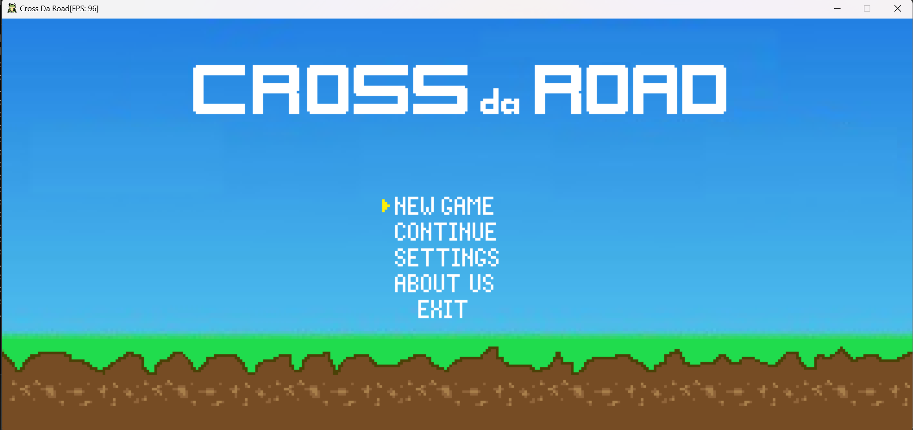

- **New Game:** Press `ENTER` to select the `New Game` option. Then enter your name in the input field and press `ENTER` to start a new game. Press `ESC` to go back to the main menu. (Use `Arrow Keys` to navigate between input field and `Start` button.)
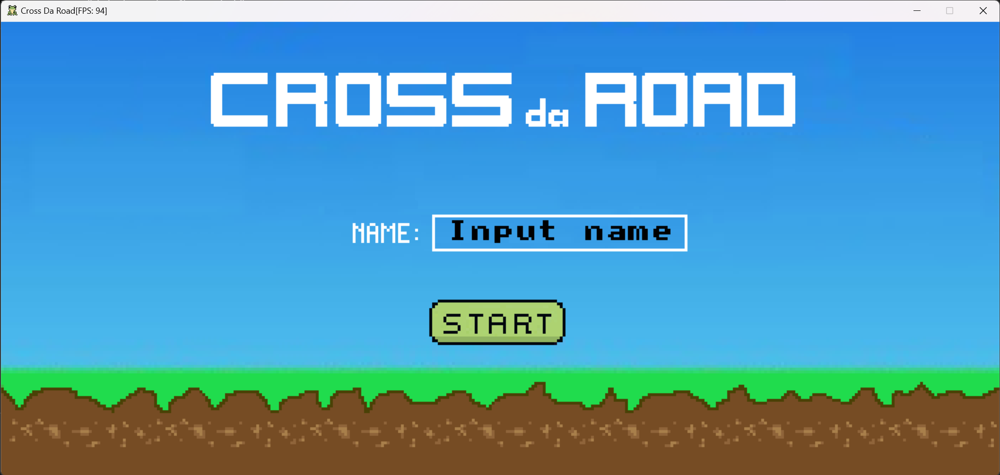
- **Load Game:** Press `ENTER` to select the `Load Game` option. Then select a saved game and press `ENTER` to load the game. Press `ESC` to go back to the main menu.
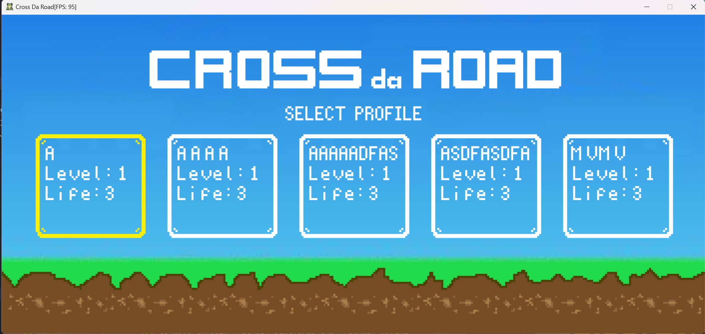
- **Settings:** Press `ENTER` to select the `Settings` option. Then toggle the `Music` option and press `ENTER` to save the settings. Press `ESC` to go back to the main menu.
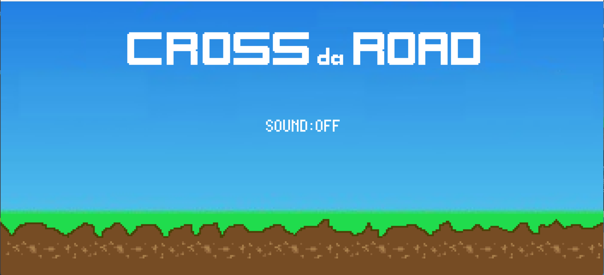
- **About us:** Press `ENTER` to select the `About us` option. Then press `ESC` to go back to the main menu.
  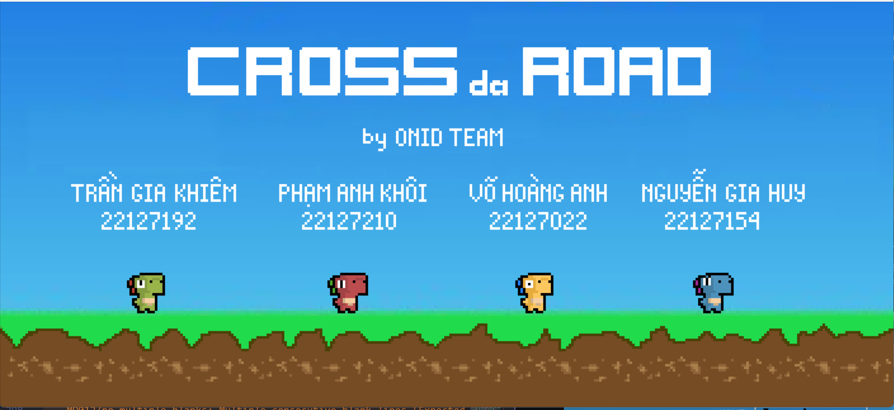

- **Exit:** Press `ENTER` to select the `Exit` option. Then press `ENTER` to exit the game. Press `ESC` to go back to the main menu. (Use `Arrow Keys` to navigate between `Yes` and `No` options.)
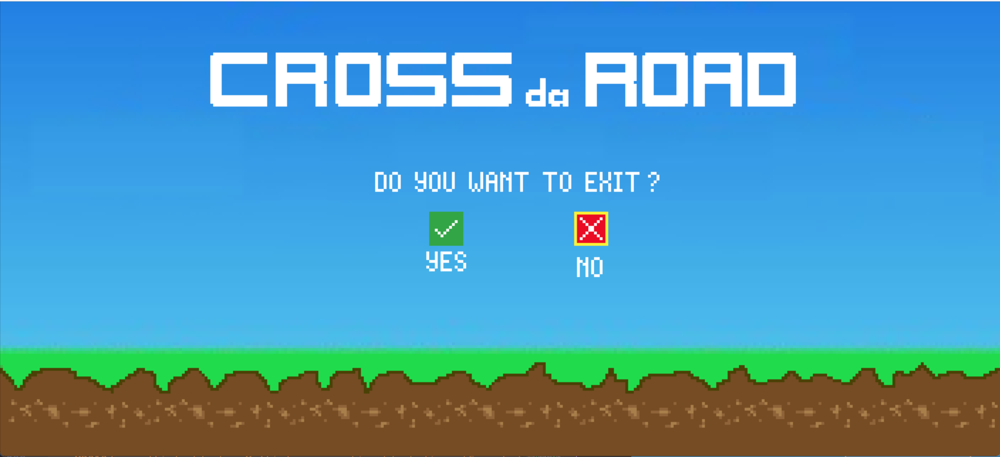

By click `ESC` when playing game, you can pause the game, and go to `Pause` menu. The `Pause` menu is the screen that the player sees when they pause the game. It contains the following options: `Resume`, `Save`, and `Menu` (use `Arrow Keys` to navigate between options).
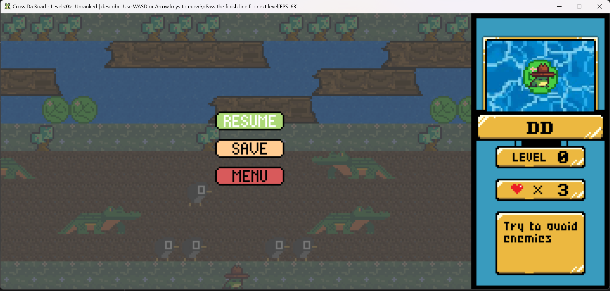

- **Resume:** Press `ENTER` to select the `Resume` option to continue the game. Press `ESC` to turn on the `Pause` menu.
- **Save:** Press `ENTER` to select the `Save` option. Then choose location to save the game. Press `ENTER` to save the game. Press `ESC` to turn on the `Pause` menu.
- **Menu:** Press `ENTER` to select the `Menu` option to go back to the main menu.

### 4.2 Controls

- **A** - Move left
- **D** - Move right
- **W** - Move up
- **S** - Move down
- **ESC** - Pause the game or go back to the previous menu
- **ENTER** - Select an option
- **ARROW KEYS** - Navigate the menu options
- **Letter keys** - Enter player name in the `New Game` menu

### 4.3 Objectives

- Guide your character from the bottom of the screen to the top safely, all while dodging oncoming traffic and other obstacles.
- The more successful crossings you achieve, the higher your score will be. Can you set a new record?
- In later levels, the game intensifies with time constraints.
- Challenge yourself to beat your high score with each game session.
- The game features various obstacles, including dangerous objects, block objects, platforms, and moving platforms, with different speeds and sizes.
- The game will end when you lose all your lives.
- You can save your game and load it later.

### 4.4 Game Interface

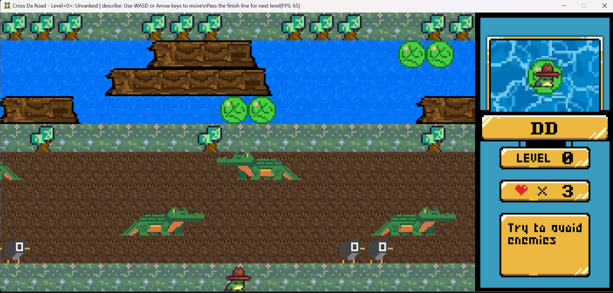
The in-game interface consists of the following elements:

- **Window Title:** The window title display at the top of the window. It contains the following information:
  - **Game Title:** name of the game.
  - **Map level:** current level of the game.
  - **Map description:**  description of the current level and show how to win this level.
  - **FPS:** current FPS of the game.
  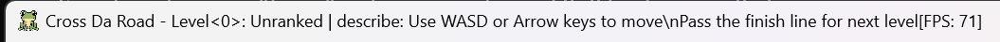
- **Status Bar:** The status bar display at the right side of the window. It contains the following information:
  - **Map level:** current level of the game.
  - **Health:** current health of the player.
  - **Description:** description of the current level and show how to win this level.
  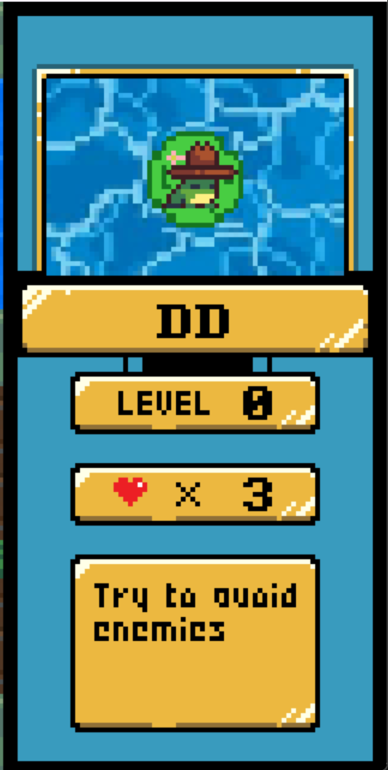
- **Main screen:** The main in-game screen display at the left side of the window. It contains the following information:
  - **Game objects:** game objects in the current level.
    - **Dangerous objects:** dangerous objects in the current level. The player will lose health when colliding with these objects (such as penguins, mammoth, alligator, devil, etc.)
    - **Block objects:** block objects in the current level. The player cannot move through these objects (such as trees, rocks, etc.)
    - **Friendly platforms:** friendly platforms in the current level. The player can move through these objects (such as rocks, ice, grass, etc.)
    - **Dangerous platforms:** dangerous platforms in the current level. The player will lose health when moving through these objects (such as river, lava, etc.)
    - **Friendly moving platforms:** friendly moving platforms in the current level. The player can move through these objects with different speeds (such as logs, moving ice, moving rocks, etc.)
  - **Player:** display as a frog. The player can move up, down, left, and right using `W`, `S`, `A`, `D` keys.
  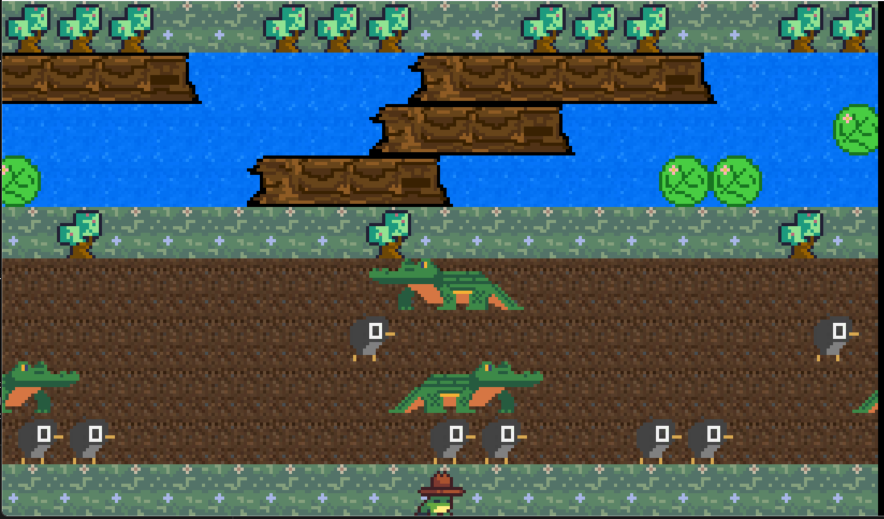

### 4.5 Tips and Strategies

- Try to avoid dangerous objects and dangerous platforms.
- Try to move through friendly platforms and friendly moving platforms.

### 4.7 Saving and Loading

- **Save:** Press `ESC` to pause the game. Then press `ENTER` to select the `Save` option. Then choose location to save the game. Press `ENTER` to save the game. Press `ESC` to turn on the `Pause` menu.
- **Load:** Press `ENTER` to select the `Load Game` option in the main menu. Then select a saved game and press `ENTER` to load the game. Press `ESC` to go back to the main menu.

### 4.8 Frequently Asked Questions (FAQ)

**Q:** How to turn on/off the sound?

**A:** If you want to turn on/off the sound, click `Settings` in the main menu and toggle the `Music` option.

## 5. Developer Guide

### 5.1 Introduction for Developers

This developer guide provides information about the development of the game. It is intended for developers who want to contribute to the development of the game. It provides information about the development of the game.It includes the following sections:

- **Development Environment Setup:** This section describes how to set up the development environment.
- **Code Structure and Organization:** This section describes the code structure and organization.
- **Coding Conventions and Standards:** This section describes the coding conventions and standards.
- **Game Architecture Overview:** This section describes the game architecture overview.
- **Documentation and Comments Standards:** This section describes the documentation and comments standards.

### 5.2 Development Environment Setup

Refer to the [2. Installation and Setup Guide](#2-installation-and-setup-guide) for instructions on how to set up the development environment.

### 5.3 Code Structure and Organization

Refer to the [3.1 Overview - Directory Structure](#31-overview---directory-structure) for information about the code structure and organization.

### 5.4 Coding Conventions and Standards

Refer to the [Coding Standard](./standard/codingStandard.md) for information about the coding conventions and standards.

Refer to the [Function Standard](../functionStandard.md) for information about the function standard.

### 5.5 Game Architecture Overview

Refer to the [3. System Architecture](#3-system-architecture) for information about the game architecture.

### 5.6 Documentation and Comments Standards

Refer to the `Comment Style` section of [Coding Standard](./standard/codingStandard.md) for information about the documentation and comments standards.

## 6. Libraries and Dependencies

## 7. Future Development

### 7.1 Upcoming Features

- **Gameplay:** Improve gameplay. Add more levels, obstacles, and challenges.
- **Graphics:** Improve graphics. Add more sprites and animations, and improve the quality of existing sprites and animations, add more visual effects, particle effects, and lighting effects.
- **Audio:** Improve audio. Add more sound effects and background music, and improve the quality of existing sound effects and background music.
- **Music:** Improve music. Adjust volume and pitch of sound effects and background music.
- **User Interface:** Improve user interface. Add more user interface elements. Smooth out the user interface.
- **Game Engine:** Improve game engine. Optimize the game engine. Improve performance, stability, and reliability.
- **Multiplayer:** Improve multiplayer. Add multiplayer support.
- **Networking:** Improve networking. Add networking support.
- **Artificial Intelligence:** Improve artificial intelligence. Add artificial intelligence support for detecting and avoiding obstacles.

### 7.2 Community Feedback and Involvement

- **Feedback:** We welcome feedback from the community. Please send us your feedback at [SPyOfGame](https://www.facebook.com/SPectiar2k)
- **Involvement:** We welcome contributions from the community. Please send us your contributions at [SPyOfGame](https://www.facebook.com/SPectiar2k)

### 7.3 Platform Support

We plan to support the following platforms:

- **Windows:** Windows 10 or above
- **Linux:** Ubuntu 20.04 or above
- **MacOS:** MacOS 10.15 or above
- **Android:** Android 10 or above
- **iOS:** iOS 14 or above
- **Web:** Chrome 90 or above

## 8. References

## 9. License
