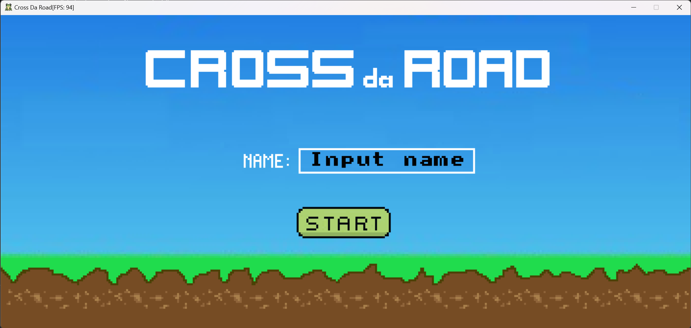
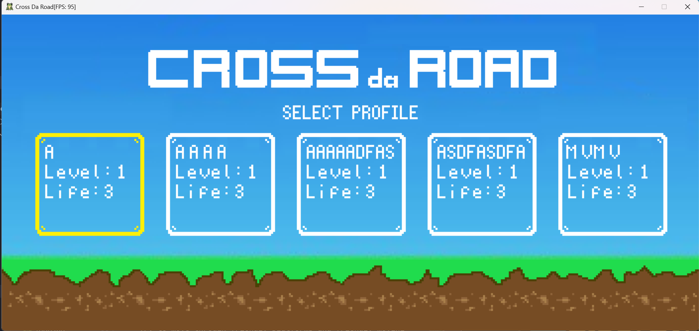
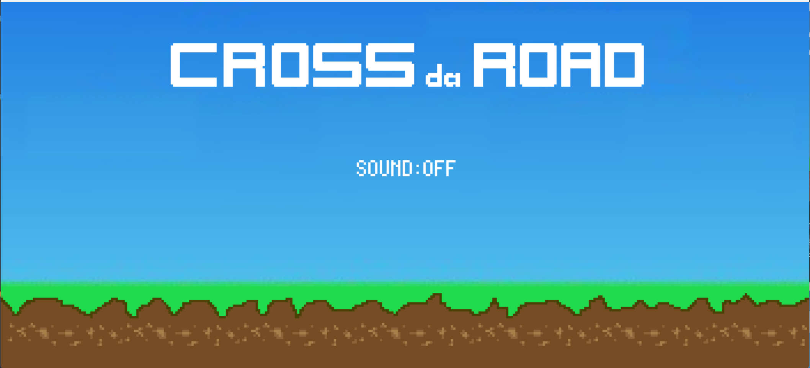
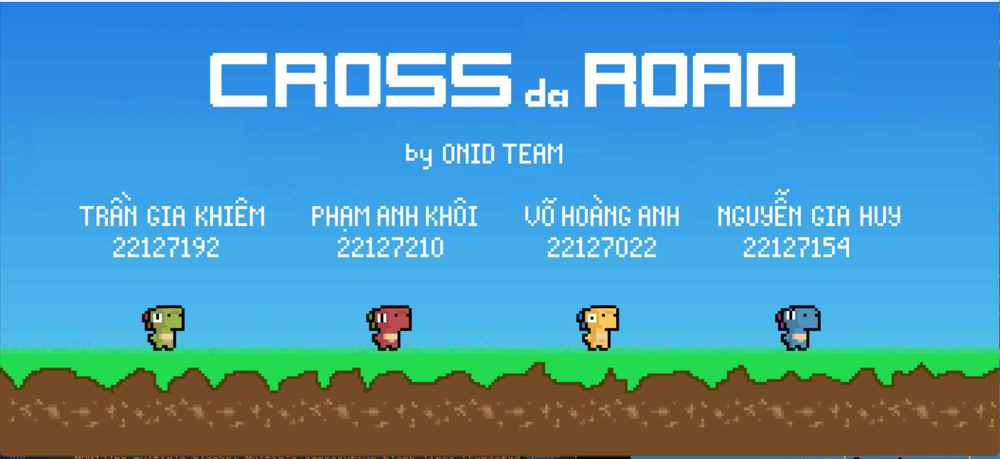
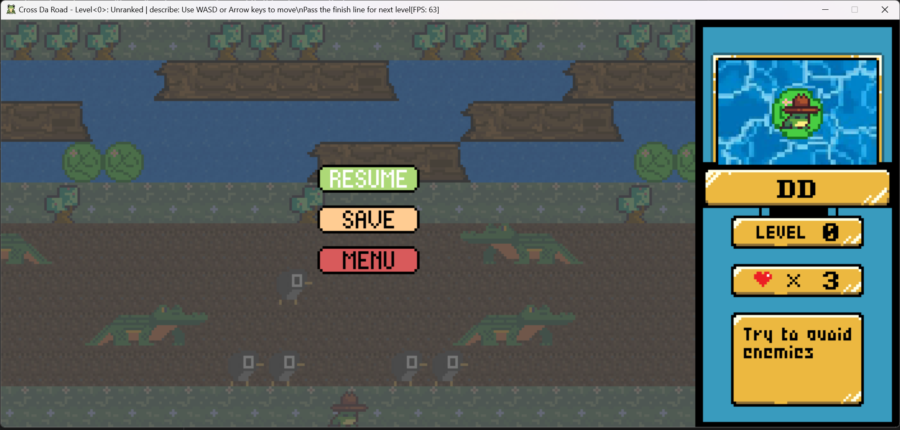
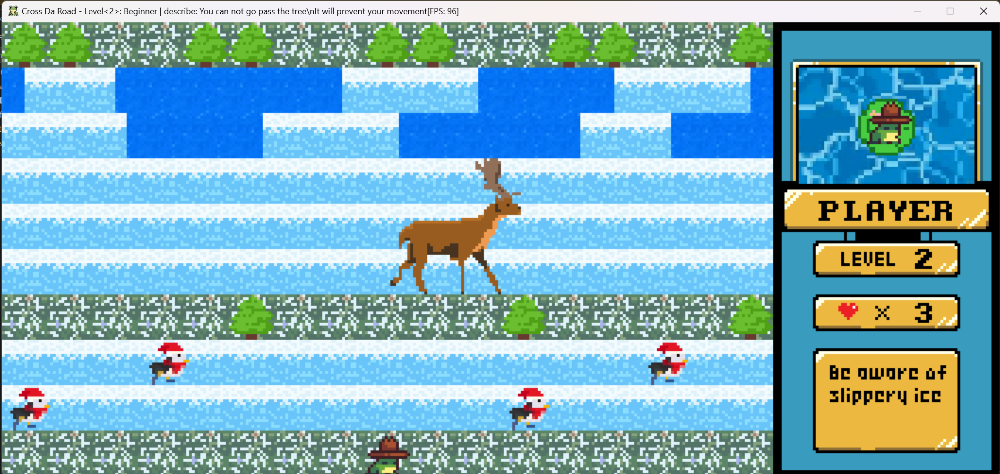

# CSC10003 Project: CrossDaRoad - A simple console game

## 1. Introduction

### 1.1 Project Overview

Welcome to the "Cross the Road" console game!
In this text-based adventure, you'll control a character on a daring journey to cross a busy road while avoiding a series of challenging obstacles.

**Features:**

- **Traffic Chaos**: The road is teeming with speedy cars. Navigate through the traffic like a pro.

- **River Crossings**: Your journey also involves crossing rivers. Jump onto floating logs to cross water bodies.
- **Game Engine**: Our internally developed game engine ensures smooth game-play, realistic physics, and engaging graphics, all within the console.
- **Dynamic Obstacles**: The game features various obstacles, including fast cars, slow-moving trucks, and swift rivers with limited time to cross.
- **High Score**: Challenge yourself to beat your high score with each game session.
- **Time Pressure**: In later levels, the game intensifies with time constraints.

### 1.2 Game Objective

Your mission is simple but challenging:

- Guide your character from the bottom of the screen to the top safely, all while dodging oncoming traffic and other obstacles.
- The more successful crossings you achieve, the higher your score will be. Can you set a new record?

### 1.3 Target Audience

This game is suitable for all ages, especially those who enjoy a challenge.

### 1.4 Inspiration

This game is inspired by the classic arcade game "Frogger" (1981).

### 1.5 Development Team

**School:** VNUHCM - University of Science

**Faculty:** Faculty of Information Technology

**Course:** CSC10004 - Introduction to Object-Oriented Programming

**Class:** 22CLC06

**Group:** 04

**Members:**

- 22127022 - Vo Hoang Anh
- 22127154 - Nguyen Gia Huy
- 22127192 - Tran Gia Khiem
- 22127210 - Pham Anh Khoi

### 1.6 Acknowledgements

- **Mr. Truong Toan Thinh** - Lecturer, Faculty of Information Technology, VNUHCM - University of Science
- **Mr. Nguyen Hai Dang** - Lab Assistant, Faculty of Information Technology, VNUHCM - University of Science
- **Mr. Do Trong Le** - Lab Assistant, Faculty of Information Technology, VNUHCM - University of Science

## 2. Installation and Setup Guide

### 2.1 System Requirements

- **Operating System:** Windows 10 or above
- **IDE:** Visual Studio 2022

### 2.2 Installation and Setup Guide

- **Step 1:** Clone [this](https://github.com/SPyofgame200/CrossDaRoad-Beta.git) repository to your local machine.
- **Step 2:** Open the project in Visual Studio 2022.
- **Step 3:** Build the project.
- **Step 4:** Run the executable file `CrossDaRoad.exe` in the `bin` folder or run the project in Visual Studio 2022 by pressing `F5`.
- **Step 5:** Enjoy the game!
- **Step 6:** (Optional) If you want to turn on/off the sound, click `Settings` in the main menu and toggle the `Music` option.

## 3. User Guide

### 3.1 Getting Started

Welcome to the "Cross the Road" console game! In this text-based adventure, you'll control a character on a daring journey to cross a busy road while avoiding a series of challenging obstacles.

The main menu is the first screen that the player sees when they start the game. It contains the following options: `New Game`, `Load Game`, `Settings`, `About us`, and `Exit`.

- **New Game:** Press `ENTER` to select the `New Game` option. Then enter your name in the input field and press `ENTER` to start a new game. Press `ESC` to go back to the main menu. (Use `Arrow Keys` to navigate between input field and `Start` button.)

- **Load Game:** Press `ENTER` to select the `Load Game` option. Then select a saved game and press `ENTER` to load the game. Press `ESC` to go back to the main menu.

- **Settings:** Press `ENTER` to select the `Settings` option. Then toggle the `Music` option and press `ENTER` to save the settings. Press `ESC` to go back to the main menu.

- **About us:** Press `ENTER` to select the `About us` option. Then press `ESC` to go back to the main menu.

- **Exit:** Press `ENTER` to select the `Exit` option. Then press `ENTER` to exit the game. Press `ESC` to go back to the main menu. (Use `Arrow Keys` to navigate between `Yes` and `No` options.)

By click `ESC` when playing game, you can pause the game, and go to `Pause` menu. The `Pause` menu is the screen that the player sees when they pause the game. It contains the following options: `Resume`, `Save`, and `Menu` (use `Arrow Keys` to navigate between options).

- **Resume:** Press `ENTER` to select the `Resume` option to continue the game. Press `ESC` to turn on the `Pause` menu.
- **Save:** Press `ENTER` to select the `Save` option. Then choose location to save the game. Press `ENTER` to save the game. Press `ESC` to turn on the `Pause` menu.
- **Menu:** Press `ENTER` to select the `Menu` option to go back to the main menu.

### 3.2 Controls

- **A** - Move left
- **D** - Move right
- **W** - Move up
- **S** - Move down
- **ESC** - Pause the game or go back to the previous menu
- **ENTER** - Select an option
- **ARROW KEYS** - Navigate the menu options
- **Letter keys** - Enter player name in the `New Game` menu

### 3.3 Objectives

- Guide your character from the bottom of the screen to the top safely, all while dodging oncoming traffic and other obstacles.
- The more successful crossings you achieve, the higher your score will be. Can you set a new record?
- In later levels, the game intensifies with time constraints.
- Challenge yourself to beat your high score with each game session.
- The game features various obstacles, including dangerous objects, block objects, platforms, and moving platforms, with different speeds and sizes.
- The game will end when you lose all your lives.
- You can save your game and load it later.

### 3.4 Game Interface

The in-game interface consists of the following elements:

- **Window Title:** The window title display at the top of the window. It contains the following information:
  - **Game Title:** name of the game.
  - **Map level:** current level of the game.
  - **Map description:**  description of the current level and show how to win this level.
  - **FPS:** current FPS of the game.
  
- **Status Bar:** The status bar display at the right side of the window. It contains the following information:
  - **Map level:** current level of the game.
  - **Health:** current health of the player.
  - **Description:** description of the current level and show how to win this level.
  
- **Main screen:** The main in-game screen display at the left side of the window. It contains the following information:
  - **Game objects:** game objects in the current level.
    - **Dangerous objects:** dangerous objects in the current level. The player will lose health when colliding with these objects (such as penguins, mammoth, alligator, devil, etc.)
    - **Block objects:** block objects in the current level. The player cannot move through these objects (such as trees, rocks, etc.)
    - **Friendly platforms:** friendly platforms in the current level. The player can move through these objects (such as rocks, ice, grass, etc.)
    - **Dangerous platforms:** dangerous platforms in the current level. The player will lose health when moving through these objects (such as river, lava, etc.)
    - **Friendly moving platforms:** friendly moving platforms in the current level. The player can move through these objects with different speeds (such as logs, moving ice, moving rocks, etc.)
  - **Player:** display as a frog. The player can move up, down, left, and right using `W`, `S`, `A`, `D` keys.
  

### 3.5 Tips and Strategies

- Try to avoid dangerous objects and dangerous platforms.
- Try to move through friendly platforms and friendly moving platforms.

### 3.6 Game Map

- **Map 1:**

- **Map 2:**

- **Map 3:**

- **Map 4:**

- **Map 5:**

### 3.7 Saving and Loading

- **Save:** Press `ESC` to pause the game. Then press `ENTER` to select the `Save` option. Then choose location to save the game. Press `ENTER` to save the game. Press `ESC` to turn on the `Pause` menu.
- **Load:** Press `ENTER` to select the `Load Game` option in the main menu. Then select a saved game and press `ENTER` to load the game. Press `ESC` to go back to the main menu.

### 3.8 Frequently Asked Questions (FAQ)

**Q:** How to turn on/off the sound?

**A:** If you want to turn on/off the sound, click `Settings` in the main menu and toggle the `Music` option.

## 4. Developer Guide

You can find the source code in the `src` folder and the documentation for developers in the section **`5. Developer Guide`** of [Full Documentation](./CrossDaRoad-Beta/CrossDaRoad-Beta/docs/report/documentation.md).

## 5. Full Documentation

You can find the full documentation for this project [here](./CrossDaRoad-Beta/CrossDaRoad-Beta/docs/report/documentation.md).

